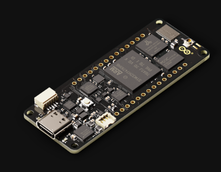
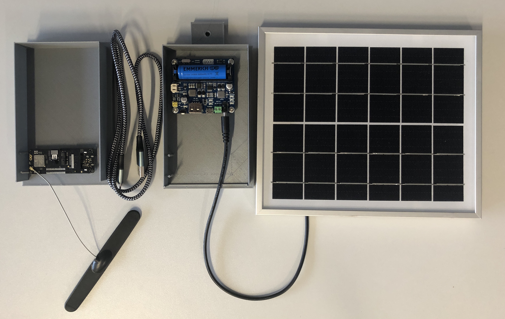

# SaveTheBees - Documentation

# Hardware in Context

Different research on beehive monitoring to assess health and overall well being of bees has come up with different approaches to do so. The less intrusive approach discovered and enabled thanks to the rapid development of machine learning systems is based on acoustic signals emitted by bees. 

Our team set the goal to transfer the research foundations to a system available to everyone. Hence, we started to explore possibilities with current technologies to create a piece of hardware with a software running on it, to enable beehive monitoring for everyone. This led to our project utilising an Arduino Portenta with LoRa Vision Shield to train and deploy a machine learning model. To power the device we use 6V solar power panel and a 3.7 LiPo 800mAh rechargeable battery. The results are transmitted via LoRaWan to the open sourced platform TheThingsNetwork from where they can be forwarded to platforms like Azure IOT, AWS IOT or similar via API. The device is hidden in a 3D-printed box to protect it from weather conditions and provide a suiting environment for the classification task. 

<aside>
💡 Creating ML models based on audio data can result in a non-intrusive way of beehive monitoring.

</aside>

### Possibilities

- Detection if beehive has a queen
- Detection of the stress level of the bees
- Detection of varroa infection
- CHECK FOR MORE IN PAPER

### Benefits

- Little effort to set-up
- Comparably cheap (~200€ for hardware)
- No costs in running device (solar powered, LoRa data transmission)
- LoRa connectivity independent of any carrier coverage
- Constantly running monitoring system - no need to manually check in on the bees
- Non-intrusive to the bees

# Hardware description

### Arduino Portenta H7



Arduino Designed for High Performance:

- Capable of training machine Learning algorithms with onboard chip
- Onboard microphone for sound analysis
- Full description: [https://www.arduino.cc/pro/hardware/product/portenta-h7](https://www.arduino.cc/pro/hardware/product/portenta-h7)

### Vision Shield with microphone, camera and LoRa connectivity

### Pentaband antenna

Used “Dipole Pentaband Waterproof Antenna” for LoRa connection:

- Waterproof
- Compatible with Arduino
- Full description: [https://store.arduino.cc/products/dipole-pentaband-waterproof-antenna](https://store.arduino.cc/products/dipole-pentaband-waterproof-antenna)

### Solar power manager for battery charging and correct voltage distribution

Used to regulate voltage provided by solar panel and save energy surplus for cloudy days:

- Battery replaceable
- Regulates 6v-24v
- Full description: [https://www.berrybase.de/solar-power-management-modul-f-252-r-6v-126-24v-solar-panel](https://www.berrybase.de/solar-power-management-modul-f-252-r-6v-126-24v-solar-panel)

### Solar panel as energy source

Used to supply energy for the whole system:

- Climate friendly
- Enough energy to run the system reliably
- Full  description: [https://www.berrybase.de/solar-panel-6v/5w-mit-3-5x1-35mm-hohlstecker](https://www.berrybase.de/solar-panel-6v/5w-mit-3-5x1-35mm-hohlstecker)

### Architecture overview


## Prototype



# Software description

## Arduino Library

- Components
    - LoRa (MKRWAN_v2) loop
    - Classification with trained model loop
    - Data writer loop for data collection

## Model

- Based on data of *Kulyukin et al. [1]*
    - Our model is not based on their research, since we had to reduce some parameters due to limited computation time and memory on the Arduino
    - We trained a similar model, based on their architecture and parameters but with some restrictions due to the used platform, available computation time and our Arduino
- Tested 32 different model architectures
- MFE feature extraction 1D conv layer performed best
- Spectrogram analysis
    - Transforming input sound data to spectograms
    - Training image classification model on resulting spectograms
- MFE
    - Audio analysis
    - Similar to spectograms with two additional steps (Mel-filterbank energy features, Normalization)
    - Mostly for non-voice recognition
    - [Further reading](https://docs.edgeimpulse.com/docs/edge-impulse-studio/processing-blocks/audio-mfe)
- MFCC
    - Audio analysis
    - Mostly for voice recognition
    - For more complex problems

### Data *[1]*

- 3h 23min of data
- 2h 23min for training set
- 2 Classes (bees, noise)
- 4,025 training windows

### Features

- Extracted via [MFE](https://docs.edgeimpulse.com/docs/edge-impulse-studio/processing-blocks/audio-mfe) (Mel-filterbank energy)
    
    
    
- Data spectogram (processed signal)
    
    
    

### Architecture

| Training cycles | 100 |
| --- | --- |
| Learning rate | 0.005 |
| Validation set size | 20 |


- Validation of trained model
    
    
    
- Predictions of test data
    
    
    

## Payload Formatter (The Things Network)

<aside>
💡 Messages get casted to bytes to send them via LoRa. Hence, a payload formatter is required to translate the incoming bytes back to string again.

</aside>

- Very simple decoder to transform bytes payload to string

```bash
function Decoder(bytes, port) {
  // Decode plain text; for testing only 
  var predictions = String.fromCharCode.apply(null, bytes);
  var values = predictions.split(" ");
  return {
      Bees: parseFloat(values[0]),
      Noise: parseFloat(values[1])
      
  };
}
```

### Example Output


# Bill of materials

| Arduino Portenta H7 | 92,20€ |  |
| --- | --- | --- |
| Arduino Portenta Vision Shield LoRa | 56,30€ | Link to product |
| Pentaband antenna | 4,20€ | Link to product |
| USB-C to USB-A cable | 6,49€ | Link to product |
| Solar panel | 11,90€ | Link to product |
| Solar power manager | 8,90€ | Link to product |
| 3.7V Lipo battery 800mAh | 11,99€ | Link to product |
| Micro SD | 14,99€ | Link to product |

## Tech-Sheet

| Processor  | Cortex-M7 216MHz |  |
| --- | --- | --- |
| Connection | LoRa (TTN) |  |
| Frequency | ~ 125kHz |  |
| Transmission | 0.3 - 5 kbps |  |
| Microphone | Vision Shield |  |
| On Board | MP34DT06JTR |  |
|  | Sensitivity | - 26 dB |
|  | Signal to Noise Ratio | 64 dB |
|  | Frequency Range | 1.2 MHz - 3.25 MHz |

# Build Instructions

### Before System deployment

1. Connect Arduino Vision Shield to Arduino Portenta H7
2. Assert SD Card to the SD card slot of the Vision Shield
3. Plugin USB C cable and connect to laptop 
    1. Either USB C to USB A 
    2. Or USB C to USB C

### After system deployment

1. Connect Arduino Vision Shield to Arduino Portenta H7
2. Assert SD Card to the SD card slot of the Vision Shield
3. Plugin USB C to USB A cable
4. Connect the USB A port to the solar power manager
5. Insert the battery to the solar power manager
6. Connect the solar panel to the solar power manager
7. Switch on the solar power manager

# Operational Instructions (Setup)

### Preparation

1. Download Github Repo
    
    https://github.com/kevinkrs7/DigitalInovationLab-Bees
    
2. Download Arduino IDE 
    
    [Software](https://www.arduino.cc/en/software)
    
3. Open Arduino IDE
    1. Go to *Sketch*
    2. Select *Include Library*
    3. Select Zip File from Github repository 
4. Connect your Arduino Portenta H7 with Vision Shield and Pentaband Antenna to your laptop

### Setup device for TheThingsNetwork (LoRa)

1. Include `MKRWAN_v2` Library in the Library Manager
2. Go to `File > Examples > MKRWAN_v2 > MKRWANFWUpdate_standalone`
3. Upload sketch
4. Go to `File > Examples > MKRWAN_v2 > FirstConfiguration`
5. Note down the `device EUI` 

### Setup TheThingsNetwork

1. Create an Account on 
    
    [The Things Network](https://www.thethingsnetwork.org/)
    
2. Follow these steps to create an application and register your device
    
    [Connecting the Vision Shield - LoRa® to TTN Using LoRa® | Arduino Documentation](https://docs.arduino.cc/tutorials/portenta-vision-shield/connecting-to-ttn)
    
3. Add a payload formatter for the uplink stream (e.g. the one described above)

### Deploy System

1. Open the `saveTheBees` folder in Arduino IDE 
2. Connect Arduino 
3. Switch to tab with `arduino_secrets.h` and insert your created *Secret App Key* and *Secret App EUI* from *TheThingsNetwork*
4. Upload Sketch to Arduino

<aside>
💡 You’ll receive a success message in the Serial Monitor as well as in your TheThingsNetwork application. If LoRa Connection fails, please try a better spot and wait for the Arduino to try reconnecting.

</aside>

# Validation and Characterization

- Testing with different bee audios (YouTube recordings)
- Testing in different environments (at home, outside)
- Testing with beehive recording by team member

# Declaration of Independence

Our project was inspired by the references below. Our team had neither financial impact nor financial influence from the referenced authors or other third parties. Our hardware was fundet by the University of Hamburg, else we had no impact on our solution by the university. 

# Conclusion

### Summing up

Unfortunately, our prototype had to be trained on very simple data that allows it to classify between bees and noise, since only one paper found provided access to their data. We tried reaching out to a specific research group that collected data on varroa mite detection, but unfortunately they could not provide us with their data. 

Further, the model trained and used for this specific case needs adjustments for the aimed task, since the classification of e.g. mite infestation or queen abstinence is trickier because in those cases we compare bee sound with each other. To train a model like that, it would require enough data and enough computational time for training, as well as testing. Further, the more complex MFCC audio feature creation is required, since the utilised MFE feature creation in this project is only suitable for simpler tasks. 

Using the LoRa technology is very beneficial, but one has to keep in mind that it is a network based on other participants. Hence, it can happen that oneself has to setup the required gateway device to guarantee a consistent LoRa connection. 

Nevertheless, our prototype gives us a first proof of concept and shows the capabilities of modern technologies, accessible to everyone and many of them free as well. We have to point out the great performance of the classification task, especially considering the very small on board microphones of the Arduino Portenta H7 Vision Shield as well as the short training time (edge impulse free version only allows 20 minutes of computation time and 4GB of data storage).

### Future development

- Start real data collection to retrain model for different recognition tasks
    - Build online database
    - Differentiate between location, bee species and classification task
    - Fine-tune model on certain beehive(s) and task
- Provide possibility to transfer collected data directly from Arduino to S3 bucket
    - Build pipeline for continuous model training via edge impulse API
- Create API for Amazon AWS IOT Cloud or Microsoft Azure IOT Cloud integration
- Test external microphones for better quality and classification enhancement

# References

1. Kulyukin, V., Mukherjee, S., & Amlathe, P. (2018). Toward audio beehive monitoring: Deep learning vs. standard machine learning in classifying beehive audio samples. *Applied Sciences (Switzerland)*, *8*(9). https://doi.org/10.3390/app8091573
2. Leppard, M., Qandor, A., Ahmad, I., & Habibi, D. (2015). Acoustics Australia. *Acoustics Australia*, *43*(1), 1–23. https://doi.org/10.1007/s40857-015-0016-5
3. Abdollahi, M., Giovenazzo, P., & Falk, T. H. (2022). Automated Beehive Acoustics Monitoring: A Comprehensive Review of the Literature and Recommendations for Future Work. *Applied Sciences*, *12*(8), 3920. https://doi.org/10.3390/app12083920
4. Loncaric, S., Sveučilište u Zagrebu. Faculty of Electrical Engineering and Computing, European Association for Signal Processing, IEEE Signal Processing Society, Institute of Electrical and Electronics Engineers. Croatia Section, IEEE Signal Processing Society. Croatia Chapter, Sveučilište u Zagrebu, & Institute of Electrical and Electronics Engineers. (2019). Extraction Applied to the Analysis of the Sounds emitted by Honey Bees in a Beehive. *ISPA 2019 : 11th International Symposium on Image and Signal Processing and Analysis*, *11*, 23–25.
